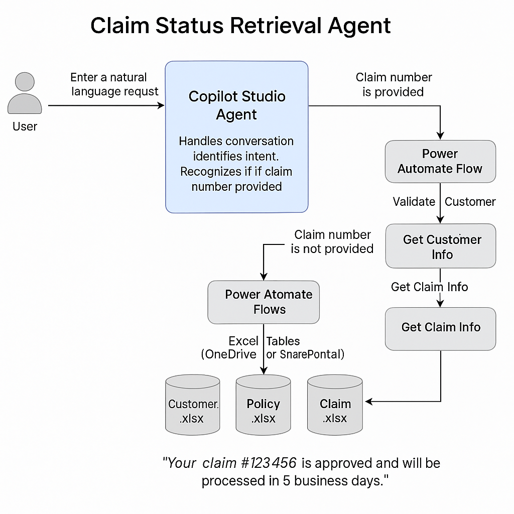

# 🤖 Claim Status Retrieval Agent using Microsoft Copilot Studio
Autonomous Claim Status Retrieval Agent built with Microsoft Copilot Studio and Power Automate. This low-code AI agent simulates a real-world insurance use case, enabling users to retrieve claim statuses with or without a claim number. Developed for the Microsoft AI Agent Hackathon 2025.

**Submission for Microsoft AI Agent Hackathon 2025**  
*By James Gnanasekaran*

---

## 🔍 Overview

This autonomous agent, built using **Microsoft Copilot Studio** and **Power Automate**, helps users retrieve the **status of their insurance claims** through a natural language conversation. It intelligently handles both cases:
- When the **claim number is provided**, or
- When the **claim number is missing**, by finding related customer and policy data.

Backend logic is simulated via Excel tables and orchestrated through Power Automate flows, fully exposed as **actions** in the Copilot Agent.

---

## 🧠 Key Features

- 🔄 **Fallback handling** – If claim number is missing, the agent retrieves it using customer and policy info.
- ✅ **User validation** – Every request checks identity before disclosing claim information.
- ⚙️ **Low-code backend** – Powered by Power Automate, Excel, and OneDrive/SharePoint.
- 🧩 **No-code interface** – Built entirely with Microsoft Copilot Studio.
- 🛡️ **Responsible AI** – Includes Human-in-the-Loop checks and respects data access boundaries.

---

## 🧱 Architecture

  
*(The agent is driven by intent recognition, Power Automate actions, and simulated Excel-based APIs.)*

---

## 🎥 Demo Video

> [📺 Watch the Demo](#) *(--)*

---

## ⚙️ Technical Components

### 🤖 Copilot Studio
- Topics: `GetClaimStatus`, `ValidateCustomer`, `FallbackFlow`
- Entities: `ClaimNumber`, `CustomerName`, `DOB`
- Actions: Trigger Power Automate flows directly from conversations

### 🔁 Power Automate Flows
| Flow Name             | Purpose                            |
|-----------------------|-------------------------------------|
| `GetCustomer`         | Verifies user identity              |
| `GetPolicyDetails`    | Fetches policy details              |
| `GetPolicyID and ClaimID` | Retrieves policy and claim number   |
| `GetClaimStatus`      | Fetches current status of the claim |

### 📊 Data Storage
- Excel files stored in OneDrive/SharePoint:
  - `customer.xlsx`
  - `policy.xlsx`
  - `claim.xlsx`

---

## 💡 Use Case Examples

- **Scenario 1**: User provides claim number → Agent validates → Returns claim status
- **Scenario 2**: User does **not** provide claim number → Agent identifies user → Fetches policy & claim info → Returns status

---

## 🌐 Business Value

- Ready to deploy in **insurance**, **banking**, or **healthcare** domains
- Scalable, modular, and secure low-code AI solution
- Great example of **responsible AI** using Microsoft tools

---

## 🎯 Future Improvements

- Connect to real backend APIs  
- Integrate Microsoft Entra ID for secure user authentication  
- Add user feedback loop to enhance performance  
- Multilingual support for international policyholders  

---

## 📚 Resources

- [Understanding AI Agents – Simple Explanation](https://www.linkedin.com/pulse/understanding-ai-agents-simple-explanation-james-gnanasekaran-gctue/)
- [Microsoft Copilot Studio Documentation](https://learn.microsoft.com/en-us/microsoft-copilot-studio/)
- [Power Automate Docs](https://learn.microsoft.com/en-us/power-automate/)

## 📄 License

This project is licensed under the [MIT License](./LICENSE).

---

## 🙌 Credits & Contact

Created by **James Gnanasekaran**  
🔗 [Connect on LinkedIn](https://www.linkedin.com/in/jamesgnanasekaran/)  
✉️ Questions or feedback welcome!

---

## 🏷 GitHub Topics

`copilot-studio` • `power-automate` • `ai-agent` • `low-code` • `insurance-tech` • `hackathon-2025` • `responsible-ai`
